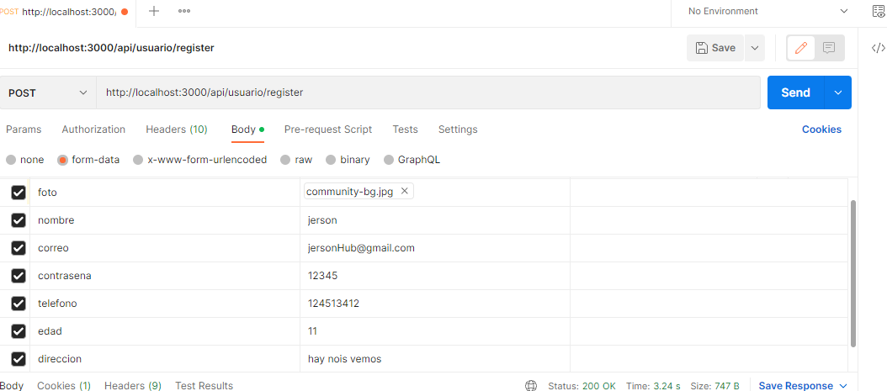
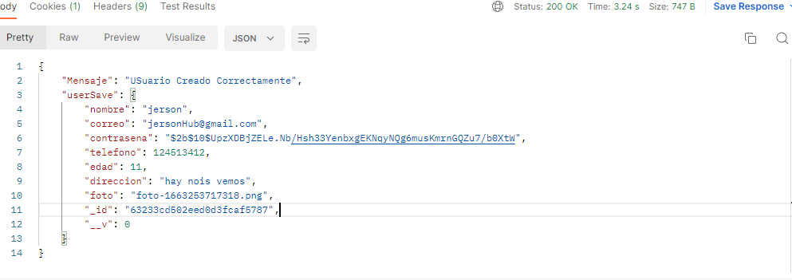
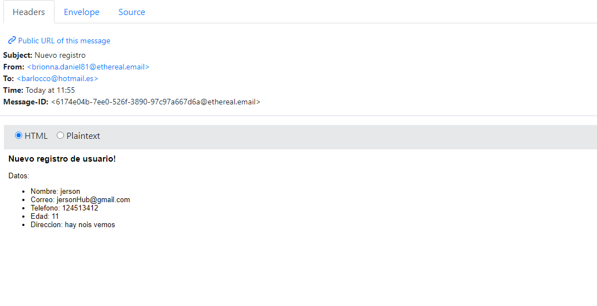
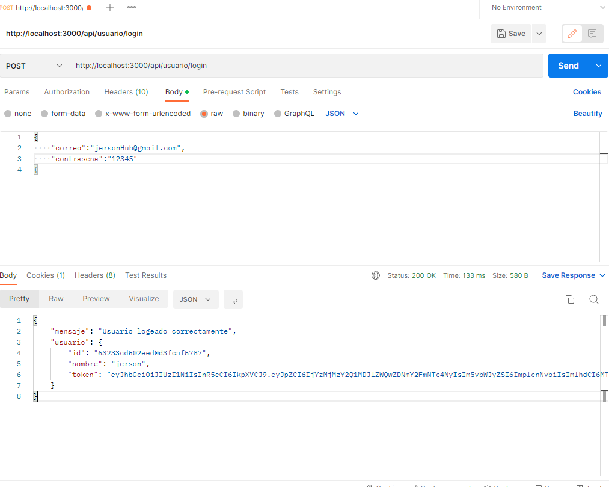
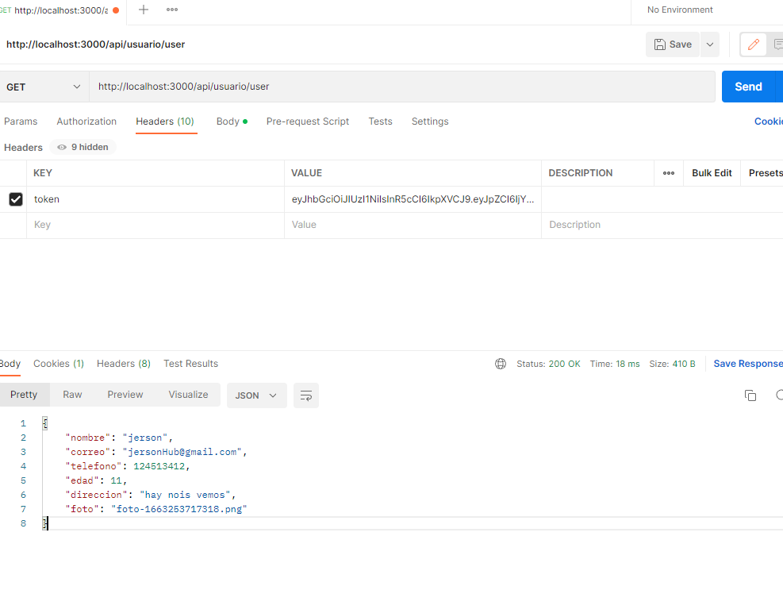
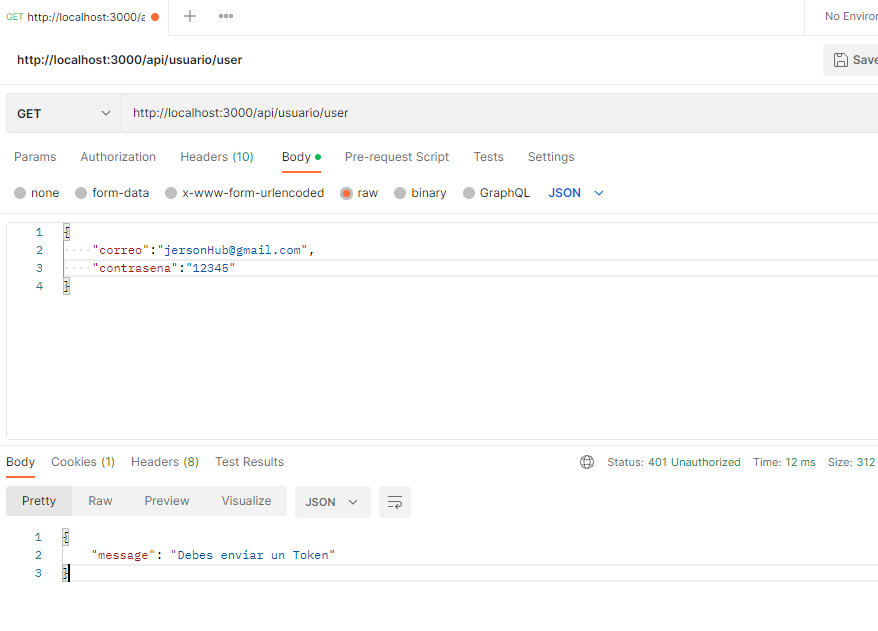
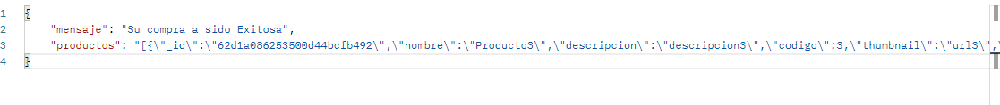
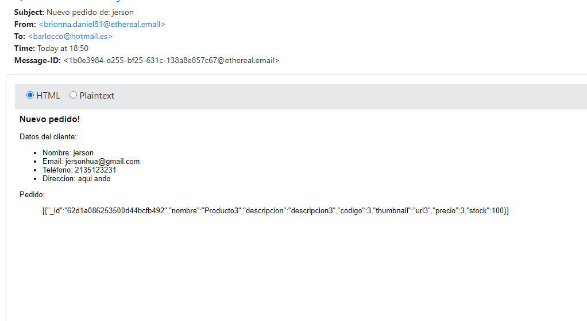
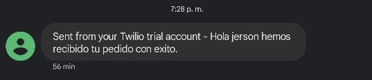
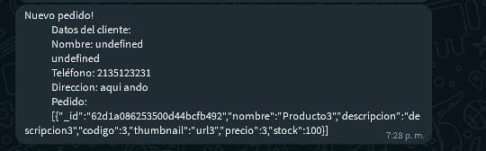

# CoderHouse

*BackEnd*

> This is a project for the course of BackEnd from the CoderHouse.

---

# Documentación

Todo es por via POSTMAN
Se Necesita un Token Para acceder algunas Rutas
El Token se genera Luego de Iniciar sesion
Si deseo Hacer una orden de compra Necesita hacer un login para obtener su token

## Rutas

| Método | Endpoint | Descripción |
| ------ | ------ | ------------|
| POST | /login | Inicio de sesion de usuarios se les dara un Token para que puedan Acceder a las demas rutas
| POST | /register | Registro de usuarios se alamacena en MongoDB
| GET | /User | Envia a ver la informacion del usuario que se registro / Se necesita Token
| GET | /api/productos | Me permite listar todos los productos disponibles
| POST | /api/productos | Para incorporar productos al listado / Se necesita Token
| GET | /api/productos/:id | Permite ver un producto especifico dando en ID / Se necesita Token
| PUT | /api/productos/:id | Permite Editar el producto Seleccionado por ID / Se necesita Token
| DELETE | /api/productos/:id | Permite Eliminar un Producto seleccionado por ID / Se necesita Token
| POST | /api/carrito | Me permite crear un carrito / Se necesita Token
| GET | /api/carrito/:id/productos | Me permite ver el carrito seleccionado por ID y sus productos / Se necesita Token
| POST | /api/carrito/:idCar/:idProd | Me permite ver el carrito seleccionado por ID y el producto seleccionado por ID / Se necesita Token
| DELETE | 	/api/carrito/id | Me permite eliminar un carrito seleccionado por ID / Se necesita Token
| DELETE | /api/carrito/:id/productos/:idProd | Me permite eliminar un producto seleccionado por ID del carrito seleccionado por ID / Se necesita Token
| GET | /api/ordenes/:idCar | Se genera una orden de compra con respecto al carrito del ID dado y le llega un mensaje al usuario que lo genero / Se necesita Token

# REGISTRO DE USUARIOS Y ENVIO DE EMAIL
- Creamos un nuevo usuario

- Observamos que se ha creado un nuevo usuario y se encripto la contraseña

 

- Recibimos un correo electrónico informando el la creacion del nuevo usuario

# OBTENER TOKEN
- Cuando ingresamos a la ruta Login se nos habilitara un token (Dura 24Hrs). Dicho Token nos permitira Navegar por algunas rutas donde sera necesario habernos logeado.

- Ejemplo de accediendo a una ruta con Token

- En caso No de no habernos logeado se nos habilitara un mensaje diciendo que falta Token

# ORDENES DE COMPRA
- Cuando habilite su orden le llegara un mensaje sobre su compra

- Se enviara un correo con los datos de usuario de quien hizo la orden de compra

- Se envía un mensaje a su celular sobre la confirmación de su compra

- Se envía un mensaje de WhatsApp a su numero asignado o bien al numero de usuario que ordeno la compra

